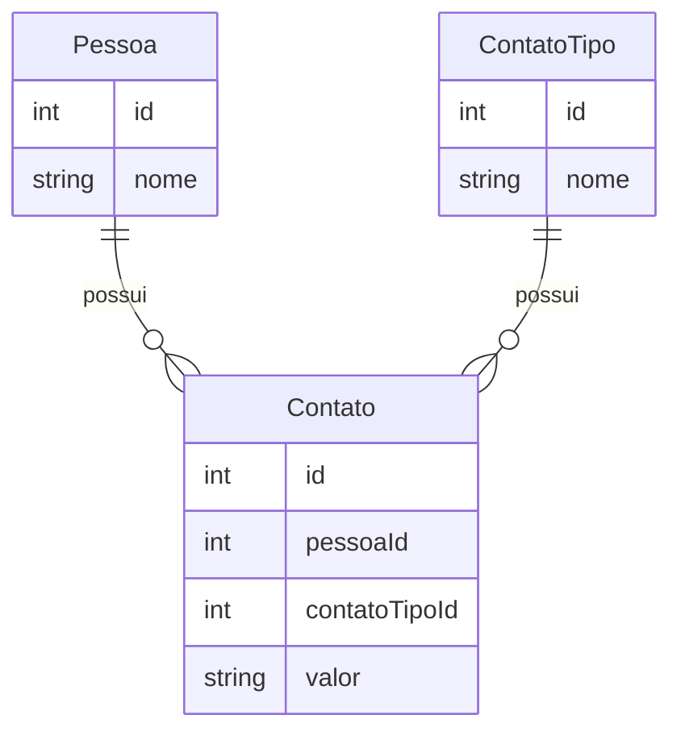

.

# [Bravi](https://bravi.com.br/) | Desafio Cadastro - Front End
O desafio consiste em criar uma interface web em Angular a fim de ser a camada visual de gerenciamento para uma API em ASP.NET Core. As principais funcionalidades consistem em cadastrar pessoas e seus respectivos meios de contato, e também o tipo de contato disponível.

## Stack Utilizada

| Tecnologia                               | Descrição                                                                                   |
|------------------------------------------|--------------------------------------------------------------------------------------------|
| [Angular 16](https://angular.io/)        | Framework de desenvolvimento de front-end para a criação de aplicações web SPA.            |
| [Tailwind CSS](https://tailwindcss.com/)  | Framework CSS altamente configurável.       |
| [Fuse.js](https://fusejs.io/)            | Biblioteca de busca e filtragem em listas de dados, oferecendo recursos avançados.        |
| [SCSS](https://sass-lang.com/)           | Pré-processador de CSS que adiciona funcionalidades extras.       |
| [fast-json-patch](https://github.com/Starcounter-Jack/JSON-Patch) | Biblioteca para aplicar patches em documentos JSON de forma eficiente e rápida.           |

---

### Detalhes sobre a arquitetura
Utilizei uma abordagem mais generica na arquitetura desse projeto, criando um [CrudBaseService](https://github.com/Evilazio/bravi.cadastro.front/blob/master/src/app/services/crud-base-service/crud-base.service.ts) para centralizar os métodos crud, e extendender os respectivos services de cada entidade desse service genérico.
O CrudBaseService possui um refreshTrigger$ ao qual é disparado sempre que uma entidade é atualizada (respectivamente em seu service), dessa forma podendo ser observada em todo o projeto tornando o mantenimento de estado confiável quando utilizado em cadeia com outros Observables.

\
\
\
Feito por [Evilazio Ricarte](https://www.linkedin.com/in/evilazio-ricarte-29ab4a1a8/)
### 😉